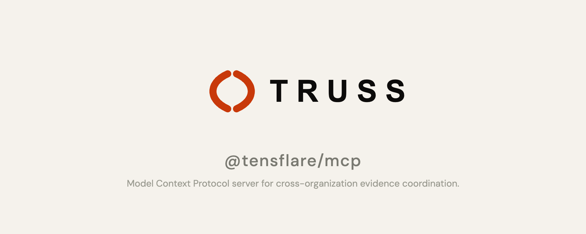

# @tensflare/mcp

**Truss MCP Server — cross-organization evidence coordination via the Model Context Protocol.**

[](https://www.npmjs.com/package/@tensflare/mcp)
[](LICENSE)
[](https://github.com/tensflare/truss-mcp/actions)

---

## What is Truss?

Truss is an **accountability layer for AI agents** — it records every agent action as a cryptographically signed, tamper-evident audit trail. [Learn more →](https://truss.tensflare.com/docs)

## Overview

`@tensflare/mcp` is a Fastify-based HTTP server that provides three MCP-compatible tools for joining, listing, and verifying evidence packages across participant organizations. It enables **cross-org evidence chain management** — multiple organizations can contribute and verify evidence in a shared accountability framework.

## Installation

```bash
npm install @tensflare/mcp
```

## Quick start

```bash
npm run dev
```

Server starts on port `4001` (configurable via `PORT` env).

## Tools

### `POST /tools/join`

Join evidence packages from multiple organizations into a single assembled package.

```json
{
  "evidence_ids": ["evp_abc123", "evp_def456"],
  "mandate_ids": ["mnd_001"]
}
```

### `GET /tools/list`

List available evidence packages across participant orgs.

### `POST /tools/verify`

Verify the integrity of an evidence package's action chain (SHA-256 content hash comparison).

```json
{
  "evidence": {
    "package_id": "evp_abc123",
    "action_log": []
  }
}
```

## Related packages

| Package | Description |
|---|---|
| [@tensflare/tap](https://github.com/tensflare/truss-tap) | Core Zod schemas for evidence and delegation data models |
| [@tensflare/truss-sdk](https://github.com/tensflare/truss-sdk-js) | TypeScript SDK for creating and verifying evidence |

## Development

```bash
npm install
npm run dev    # Start dev server with hot reload
npm test       # Run tests
```

## Contributing

Pull requests are welcome. Please see the [contribution guidelines](https://truss.tensflare.com/docs/contributing).

## License

Apache 2.0 — see [LICENSE](LICENSE).
